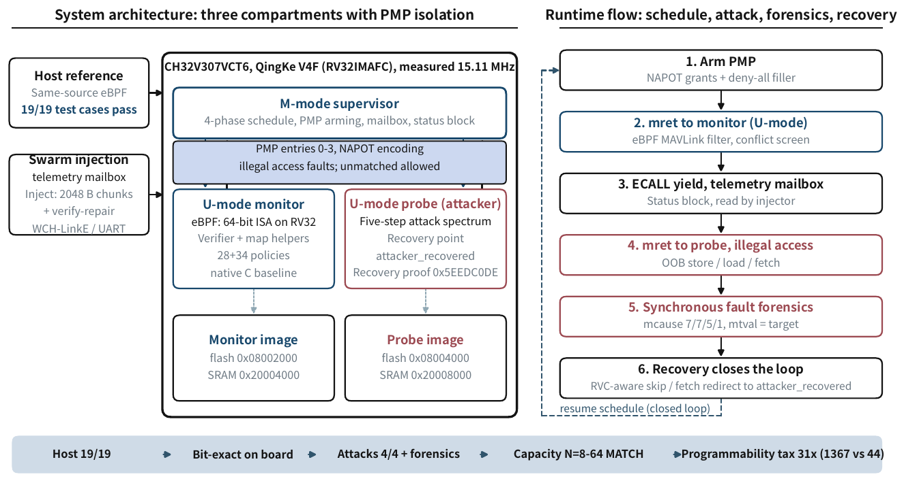

# Interclus

*An eBPF interpreter enclosed by RISC-V PMP.*

An eBPF interpreter running unprivileged inside RISC-V PMP compartments on a
CH32V307 (RV32IMAFC, no MMU). A machine-mode supervisor arms the boundaries,
schedules the compartments, and closes a capture-forensics-recovery loop:
every faulting access is logged with `mcause` and `mtval`, then skipped or
redirected, and the monitor keeps running.

**No hardware needed.** The full capacity sweep runs under QEMU:

    bash qemu/build_qemu.sh
    qemu-system-riscv32 -M virt -bios none -kernel build/fw_qemu.elf -nographic

Eight swarm sizes (N=8..64) go through the same four-phase schedule as the
board: eBPF filtering, grid screening, a native-C reference filter, and the
five-step attack spectrum. Each pass prints its evidence:

    verdicts: 1 1 0 2 3 4
    insns:    15 12 5 12 13 15
    alerts:  board=4 mirror=4
    attack:  n=4 mtval: 0x80200200 0x80200080 0x80200200 0x80100000
    integrity: verdicts=1 checksum=1 own=1 native=1 proof=1
    == MATCH ==

    ...

    == SWEEP 8/8 MATCH ==

The alert counts across the sweep are 0, 0, 3, 4, 10, 15, 19, 26 -- the same
numbers the board produces (see below).

## What you can learn here

- PMP compartmentalization on a real MCU: NAPOT regions, a deny-all filler
  entry, and measured vendor quirks (four usable entries, unmatched-allow,
  misaligned `mtvec` breaks trap delivery)
- an eBPF subset interpreter with full 64-bit semantics on a 32-bit core
- an adversarial probe that attacks the isolation and gets caught, with
  address-precise forensics
- one firmware, two targets: real silicon and QEMU, via `core/platform.h`

## Layout

    core/                 contract.h, eBPF interpreter, helpers, trap capture, platform map
    modules/              supervisor, monitor task, attacker probe, policies, board map
    qemu/                 QEMU target: boot, fixture mailboxes, evidence report
    tests/                host tests
    tools/                swarm injection + host-side mirror check
    docs/                 architecture figure
    reference/            firmware image used for recorded results
    build.sh              board firmware
    qemu/build_qemu.sh    QEMU firmware

## Host tests

    gcc -fsanitize=address,undefined -ffreestanding -o t tests/test_host.c core/ebpf.c core/helpers.c
    ./t

53 test cases must pass. The same C99 interpreter is compiled for x86-64 and
RV32; verdicts and instruction counts must agree bit-exactly.

## Run on board

Hardware: CH32V307VCT6 board + WCH-LinkE debugger.

    ./build.sh                            # -> build/fw_pmp.bin
    wlink flash -e build/fw_pmp.bin
    python3 tools/inject_swarm.py 32 --seed 7

    swarm N=32 (seed=7)  host alerts=4  board alerts=4
    RESULT: MATCH ✅

Try other sizes (8 to 64, the full mailbox capacity) and seeds.

## PMP semantics probe

A dedicated probe firmware measures the core's PMP behavior and dumps raw
evidence to SRAM:

    wlink flash -e build/pmp_probe.bin
    wlink dump 0x20000100 400     # CSR read-backs, fault log, U-mode markers

The last stage ends hung by design (misaligned-`mtvec` trap test); reflash
`build/fw_pmp.bin` afterwards.

## Roadmap

- UART data path to replace the debugger mailbox
- more example policies
- support for other PMP-capable RISC-V MCUs

## Toolchain

| Use | Needs |
| --- | --- |
| host tests | gcc (or clang) |
| board firmware | clang with riscv32 target, `lld` or rust-lld, `riscv64-unknown-elf-objcopy`, `wlink` |
| QEMU firmware | clang with riscv32 target, `lld` or rust-lld, `qemu-system-riscv32` |
| swarm tool | python3 |

## License

MIT
